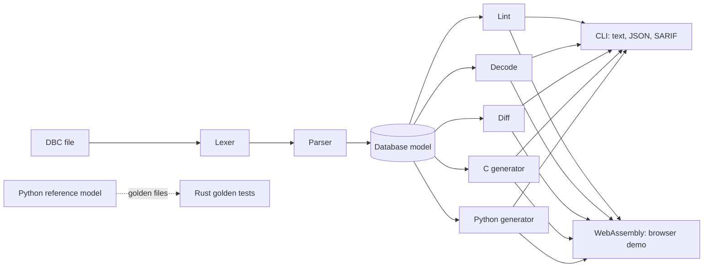

# canforge

**Check, visualize, decode and diff CAN databases, and generate the embedded C that packs them.**

[](https://github.com/Swaraj-Patil/canforge/actions/workflows/ci.yml)

**[Try it in your browser](https://swaraj-patil.github.io/canforge/)**: open the example bus, click any bit of a frame, and watch the decoded values change. Every row of the bit grid shows its byte in hex and decimal, and each signal's name sits across its bits. Click a signal to inspect it: its layout in words, its scaling, the range its bits can hold, its value descriptions, and the exact C that canforge generates for it. The page runs the same Rust code as the command-line tool, compiled to WebAssembly, and your file never leaves the browser. It parses the file once and keeps it in memory, so decoding stays instant even on databases with thousands of signals; the summary shows how long parsing took.

---

Every ECU in a vehicle talks over CAN, and a DBC file is the contract that says where each signal lives in each frame: which bits, which byte order, how to scale them, and what the values mean. Get one bit wrong and a decoder reads 400 V as 25,000 V, silently. canforge treats that contract like code:

- **Lint** a DBC file with 19 rules: overlapping signals, signals that run past the frame, duplicate IDs, ranges the bits cannot represent, multiplexing mistakes, invalid CAN FD lengths and more. Output as text, JSON, or SARIF for inline annotations on GitHub pull requests.
- **Generate embedded C**: one struct per message plus `pack`/`unpack` functions that move each byte with a single shift and mask. C99, no heap allocation, no global state, warning-free under `-Wall -Wextra -Wpedantic -Wconversion` and nine more warning flags. Also generates dependency-free Python decoders for test benches and log analysis.
- **Decode** raw frames into physical values, including multiplexed messages, IEEE 754 float signals and 64-bit fields.
- **Diff** two revisions and classify every change: *breaking* (existing decoders would misread frames), *needs review*, or *compatible*. Exits non-zero on breaking changes, so it can gate pull requests.
- **Visualize** where every signal sits, in the terminal or in the browser, where you can find any message by name, signal name or frame ID (press `/`).

canforge has **no dependencies**. One Rust crate builds both the native CLI and a small WebAssembly module with no imports.

## Quick start

```sh
cargo install --git https://github.com/Swaraj-Patil/canforge
```

```sh
canforge lint examples/powertrain.dbc
canforge layout examples/powertrain.dbc --message WheelSpeeds
canforge decode examples/powertrain.dbc 0x100 e8 03 03 5a 18 fc 00 05
canforge gen c examples/powertrain.dbc -o generated/
canforge diff tests/fixtures/diff/v1.dbc tests/fixtures/diff/v2.dbc
```

Linting the example bus:

```
examples/powertrain.dbc:87: info I002: message 'DiagnosticFD' is 64 bytes long, so it needs CAN FD
examples/powertrain.dbc: 0 errors, 0 warnings, 1 note
```

Comparing two revisions of a bus:

```
tests/fixtures/diff/v1.dbc -> tests/fixtures/diff/v2.dbc
Verdict: breaking (4 breaking, 4 caution, 5 compatible)

breaking
  Status.Counter layout changed: start bit 56 -> 60
  Battery.Voltage scaling changed: factor 0.01 -> 0.02
  Legacy (0x300) removed
  Charger frame ID changed from 0x400 to 0x410

caution
  Status.Speed unit changed: "km/h" -> "kph"
  Status.Mode renamed to DriveMode
  Battery length increased from 8 to 12 bytes
  Battery.Current range narrowed: [-1638.4|1638.35] -> [-1000.0|1000.0]

compatible
  Status.Gear value descriptions added for 4
  Status.Brake added at 24|1@1+
  Status comment changed
  Battery.Voltage range widened: [0.0|655.35] -> [0.0|1310.7]
  Diagnostics (0x500) added
```

Note that `Mode` becoming `DriveMode` is reported as one rename, not a removal plus an addition, and `Charger` is recognised as a moved frame rather than a deleted message.

## What the generated C looks like

Two 12-bit wheel speeds packed big-endian (Motorola) across three bytes, from [`tests/golden/powertrain.c`](tests/golden/powertrain.c):

```c
    /* WheelSpeedFL */
    v = (uint64_t)src_p->wheel_speed_fl;
    dst_p[0] = (uint8_t)(dst_p[0] | (uint8_t)((v >> 4) & 0xFFu));
    dst_p[1] = (uint8_t)(dst_p[1] | (uint8_t)((v & 0xFu) << 4));

    /* WheelSpeedFR */
    v = (uint64_t)src_p->wheel_speed_fr;
    dst_p[1] = (uint8_t)(dst_p[1] | (uint8_t)((v >> 8) & 0xFu));
    dst_p[2] = (uint8_t)(dst_p[2] | (uint8_t)(v & 0xFFu));
```

No loops and no bit-at-a-time work: one shift-and-mask per byte the signal touches. Multiplexed messages pack and unpack through a `switch` on the multiplexer, so alternative signals sharing the same bits never corrupt each other. Every `encode` clamps before converting from `double`, so out-of-range or NaN input can never trigger undefined behaviour.

## How correctness is verified

Bit packing is where CAN tooling goes wrong quietly, especially Motorola byte order, where a signal's bits snake down through one byte and continue at the top of the next. canforge is verified the way safety-critical code usually is: against an independent reference.

| Check | What it proves |
|---|---|
| **Reference model** ([`reference/canforge_ref.py`](reference/canforge_ref.py)) | An executable specification in plain Python that packs one bit at a time and shares no code with the generator. |
| **Golden files** ([`tests/golden.rs`](tests/golden.rs)) | The Rust output must match the reference byte for byte: generated C and Python, 280 decoded frames compared as exact IEEE 754 bit patterns, the range every signal's bits can hold (64-bit bounds as exact integers), all lint findings and all diff results. The C the browser shows for any one signal must appear verbatim in the generated files. |
| **Every bit layout** | All 4,160 placements that fit an 8-byte frame (both byte orders, every start bit and length), round-tripped through two independent packing methods. |
| **Differential C test** | The generated C packs and unpacks 2,800 random frames and is compared field by field against the reference: 40,117 checks, run under AddressSanitizer and UndefinedBehaviorSanitizer. |
| **Strict compilation** | The generated C must compile with `-Werror` under 13 warning flags, and the header must compile as C++. |
| **WebAssembly smoke test** ([`tests/wasm_smoke.mjs`](tests/wasm_smoke.mjs)) | The browser build runs in Node against the same golden files: generated code, and all 280 frames decoded through the database the module keeps loaded, compared as exact IEEE 754 bit patterns. Plus 2,000 repeated calls to catch leaks. |
| **Browser tests** ([`web-tests/`](web-tests/)) | Playwright drives the assembled site in Chromium: the example bus, flipping a bit and reading the new value, Problems, Generated code and Compare. |
| **Timing budgets** ([`tests/wasm_perf.mjs`](tests/wasm_perf.mjs), [`web-tests/tests/performance.spec.js`](web-tests/tests/performance.spec.js)) | On a synthetic database of 500 messages and 5,000 signals, loading takes under 500 ms, and a bit flip redraws the page within 50 ms (16 ms on the example bus). Every run prints the measurements. |

CI regenerates the golden files from the reference model on every push and fails if anything drifts.

## Use it in CI

[`examples/ci/dbc-check.yml`](examples/ci/dbc-check.yml) is a ready-to-copy GitHub Actions workflow for any repository that keeps DBC files under version control. On each pull request it lints the database, uploads SARIF so findings appear inline on the diff, and fails the check if the change is breaking.

## Lint rules

| Rule | Severity | Catches |
|---|---|---|
| E001 | error | Two signals in the same frame use the same bits (multiplexing-aware) |
| E002 | error | A signal extends past the end of its frame |
| E003 | error | Two messages share a frame ID |
| E004 | error | A message or signal name is defined twice |
| E005 | error | A scaling factor of zero, so the signal cannot be encoded |
| E006 | error | A signal shorter than 1 bit or longer than 64 |
| E007 | error | A frame ID that does not fit its 11-bit or 29-bit format |
| E008 | error | A multiplexed signal with no multiplexer |
| E009 | error | More than one multiplexer in a message |
| E010 | error | A frame length that is not valid for CAN or CAN FD |
| E011 | error | A float signal that is not 32 or 64 bits |
| E012 | error | A multiplexer value the multiplexer signal cannot represent |
| W001 | warning | A declared range the raw bits cannot represent |
| W002 | warning | A minimum greater than the maximum |
| W003 | warning | A transmitter or receiver not declared in `BU_` |
| W004 | warning | Two signal names that collide as C identifiers |
| W005 | warning | A value description outside the signal's raw range |
| I001 | note | A node that never transmits or receives |
| I002 | note | A frame longer than 8 bytes, which needs CAN FD |

Code generation refuses to run while any error remains.

## Architecture



| Path | Contents |
|---|---|
| `src/` | The crate: lexer, parser, bit layout, lint, decode, diff, C and Python generators, JSON and SARIF output, CLI, WebAssembly entry points |
| `reference/` | The Python reference model, its tests, the differential C harness generator, the golden-file generator and the large synthetic database for timing checks |
| `tests/` | Golden-file tests, lint and diff fixtures, the WebAssembly smoke test and timing check |
| `web/` | The browser demo: plain HTML, CSS and JavaScript, no build step |
| `web-tests/` | Playwright browser tests for the demo; development only, never deployed |
| `scripts/` | Assemble the site exactly as CI does, and serve it locally |
| `examples/` | An example powertrain bus and the reusable CI workflow |

## Building from source

```sh
cargo test                                                  # unit and golden tests
cargo build --release                                       # the CLI
rustup target add wasm32-unknown-unknown
cargo build --release --lib --target wasm32-unknown-unknown # the browser module
```

To run the browser demo locally, build the module, assemble `site/` the same way CI does, and serve it at http://127.0.0.1:8000/:

```sh
scripts/dev-site.sh
```

The browser tests run against that assembled `site/` in Chromium:

```sh
(cd web-tests && npm ci && npx playwright install chromium)   # once
scripts/assemble-site.sh && (cd web-tests && npx playwright test)
```

To check the timing budgets of the WebAssembly module on a large synthetic database:

```sh
python3 reference/make_large_dbc.py build/large.dbc
node tests/wasm_perf.mjs target/wasm32-unknown-unknown/release/canforge.wasm build/large.dbc
```

The reference model needs only Python 3:

```sh
cd reference && python3 -m unittest -v test_reference
python3 reference/make_golden.py   # regenerate tests/golden after changing behaviour
```

## Scope

canforge reads the parts of the DBC format that describe frames and signals: nodes, messages, signals, simple multiplexing, comments, value descriptions and float signal types. Attributes, environment variables and signal groups are parsed and skipped. Extended multiplexing (`SG_MUL_VAL_`) is not supported yet.

Decoding a frame by its ID, in `canforge decode` and in the browser, picks the first message in the file with that number, whether the frame is standard (11-bit) or extended (29-bit). A file that defines both a standard and an extended frame with the same number therefore decodes the one that comes first. This is intentional for now: a frame ID typed by hand does not say which format it is. Log replay, where every frame records its format, will look frames up by number and format together.

## License

MIT. See [LICENSE](LICENSE).
